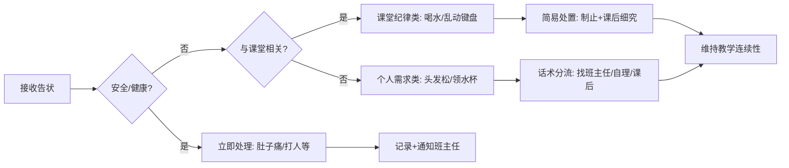

 ### 1、任务名称
**低年级课堂告状智能分流与边界管理**

### 2、触发情景
- **学段特征**：小学低段（1-3年级），特别是刚入学的一年级和三年级的信息技术课
- **班级规模**：大班额（每班约50人，教师同时任教两个班，共100名学生）
- **时空场景**：课间休息（大课间、午休、午餐后）、课堂进行中、上下课过渡时段
- **教师身份**：新入职教师（入职3年内），同时承担主科（数学）与副科（信息技术）教学，需协助班主任进行班级管理但非正班主任
- **学生状态**：学生处于"脱离幼儿园不久"的适应期，依赖性强，规则意识薄弱，兴奋度高（"他们有点兴奋"），缺乏自主解决冲突的能力
- **物理环境**：教室、走廊、机房（信息技术课），教师常处于"站在那都有人来找我"的暴露状态

### 3、核心问题
**高频琐事对教学精力的侵蚀与边界模糊导致的角色超载**

具体表现为：
- **告状洪水**：低段学生"真的很喜欢告状"，内容涵盖"喝水、打人、乱弄键盘、跳出座位、抢笔、摸隐私部位、头发松了、肚子痛"等，教师每日需处理"青天大老爷"式的海量诉求，导致"头都大了"的心理负荷
- **真假混杂与优先级混乱**：学生"答非所问"或"直接就说"，教师难以快速判断哪些是"必须马上管的"（如打架、身体疼痛），哪些是"下课再说"的（如物品丢失），导致教学节奏频繁被打断（"我在这讲课，他就说"）
- **过度依赖与班主任边界不清**：学生"更依赖班主任，因为那个班主任是个老班主任，像他们的奶奶一样"，当班主任不在时，全部涌向副科/数学教师，而新教师往往"很敷衍的解决"或过度投入，陷入"没有解决完"的恶性循环
- **情绪耗竭**：教师从"上个学期尽心尽力的问"到"这个学期变了"，采取"敷衍"态度，存在"放下助人情节"的职业倦怠风险

### 4、解决方案
**基于"三级分流"的线性处理流程**

**具体策略：**

1. **即时分类话术库**（基于访谈真实做法）：
   - **课堂阻断型**："只允许说与课堂有关的事情，其他的是下课解决"（建立即时边界）
   - **证据固定型**："你去把他叫来"（对于打人等冲突，要求学生带当事人对质，而非单方面叙述）
   - **自理引导型**："你去把他找来"（对于跨班纠纷，要求学生自主寻找当事人，而非教师代劳）
   - **转移归属型**：明确告知"找班主任"或"找班长"（利用"教师子女班"或班长的管理资源）

2. **差异化响应机制**：
   - **紧急类**（身体疼痛、严重冲突）：立即处理但简化流程（如"唯一解决的就是那两个肚子痛的，还有那个打人的"），随后转交班主任
   - **教学干扰类**（纪律问题）：课堂中"马上停止你的教学，管他们的纪律"，使用控制电脑等技术手段制止，但不当场深究
   - **琐事类**（物品、个人需求）：统一话术"下课解决"或"找班主任"，避免成为"判官"

3. **班主任协同协议**：
   - 明确非班主任教师的"临时处置权"而非"完全处理权"（"全部一一给班主任说了一遍"）
   - 建立"班主任不在时的标准响应"：记录清单+延迟处理，避免现场断案

4. **预防性管理**：
   - 建立"小老师"制度（班长协助处理自闭症等特殊学生旁的事务）
   - 课前常规训练（"常规管理"中的口令系统）减少课堂中的告状需求

### 5、评价准则（基于智能体输出的评价维度）

**对智能体分流建议的评价**：

| 维度 | 权重 | 优秀（A） | 合格（B） | 不合格（C） |
|------|------|-----------|-----------|-------------|
| **分类标准的清晰性** | 30% | 明确区分"紧急（安全/健康）""课堂相关""琐事"三类，判断标准具体可操作，教师能快速决策 | 有分类框架，但标准不够清晰，教师需要判断 | 分类模糊，教师无法快速判断优先级 |
| **话术的实用性** | 25% | 提供具体的课堂阻断、证据固定、自理引导等话术，教师能直接使用或微调 | 有话术建议，但不够具体或不够自然 | 缺乏具体话术，教师需要自己想 |
| **教学连续性保护** | 25% | 强调分流的目的是维持教学进度，建议既能回应学生又不过度打断课堂 | 基本考虑教学连续性，但重点不够突出 | 忽视对教学连续性的保护 |
| **教师心理支持** | 20% | 明确"不是所有琐事都需要教师处理"，帮助教师放下"青天大老爷"的角色期待，设定合理边界 | 基本支持，但不够充分 | 可能强化教师的全能责任感 |

**过程评价维度：**

| 维度 | 权重 | 分级描述 |
|------|------|----------|
| **问题解决效能** | 30% | 优秀：能在30秒内完成告状分类与分流，教学中断<1分钟；合格：处理得当但中断2-3分钟；不合格：陷入长时间调解，课堂停滞 |
| **育人效能** | 30% | 优秀：通过话术引导学生自主解决或寻求合适帮助（如"你去把他叫来"），逐步减少告状频率；合格：解决当下问题但未培养自主性；不合格：简单压制或过度代劳 |
| **社会情感支持** | 20% | 优秀：对真实求助（如身体疼痛）给予及时关怀，对虚假告状温和而坚定；合格：基本区分真假；不合格：忽视真实需求或过度严厉 |
| **教师心理负荷** | 20% | 优秀：教师感到"有掌控感"而非"头大了"；合格：能应对但感疲惫；不合格：产生"敷衍"心态或情绪崩溃 |

**结果评价（量规）：**

- **告状频次变化率**：一学期内非紧急告状次数下降50%以上为优，下降20-50%为良，无明显变化为差
- **学生自主性指标**：能自主解决简单冲突（如"你把他叫来"后双方自行和解）的比例
- **教学连续性指数**：因告状导致的教学中断次数每周<3次为优，3-5次为合格，>5次为不合格

### 6、案例对比

**正面案例（专家教师实际做法）：**

1. **边界清晰的快速分流**（访谈原文）：
   > "我说只允许说与课堂有关的事情，其他的是下课解决。他们会说什么？我说不准喝水，他们就会告状，老师谁谁谁喝水了...老师他打我...老师我的头发松了...我说你去把他叫来...老师他打我，你去把他叫来..."

   **分析**：教师建立了清晰的"课堂相关性"筛选标准，对非紧急事项使用"下课解决"的标准话术，对冲突类使用"带当事人来对质"的证据固定法，避免成为单方面的"青天大老爷"。

2. **优先级分层处理**（访谈原文）：
   > "一时间我唯一解决的就是那两个肚子痛的，还有那个打人的，打了自己同桌的，另一个被其他班找来说我们班打了他的，他最后去找的谁我也不知道，反正我全部一一给班主任说了一遍..."

   **分析**：教师快速识别出生理需求（肚子痛）和安全冲突（打人）为最高优先级立即处理，其他跨班纠纷记录后转交班主任，既履行了安全责任，又避免了陷入无尽的纠纷调查。

3. **态度管理**（访谈原文）：
   > "因为他们说我批评人的时候有点温柔...当你作为一个温柔的老师，他们只会得寸进尺。当你做一个很凶狠的人，他们就会害怕，你就会稍微认真一点。"

   **分析**：教师意识到低段学生对教师"温柔/凶狠"信号的敏感性，通过调整语气建立权威，减少因"温柔"导致的告状泛滥。

**反面案例（典型误区）：**

1. **过度介入型（新教师常见）**：
   - **表现**："上个学期我会尽心尽力的问，你怎么能动手呢？你怎么能打他呢？...很敷衍的解决一些问题"（前期过度投入，后期过度敷衍的摇摆）
   - **后果**：学生形成"只要找老师就能解决"的依赖，教师从"尽心"迅速滑向"敷衍"，产生职业倦怠

2. **缺乏分类的"全接型"**：
   - **表现**：对"老师帮我领一下水杯吗？老师我的头发松了，你能重新帮我扎一下吗？"等生活需求全部应允（"我帮他随便找了一下"）
   - **后果**：教师成为"生活保姆"，课间被琐事占据（"一下课总有人找我"），且无助于培养学生的自理能力

3. **课堂中断型**：
   - **表现**：学生告状"老师他跳出去了，老师还在玩电脑"时，立即长时间中断教学去调查细节
   - **后果**："抑制不住他们的兴奋"，课堂节奏被频繁打断，教学任务无法完成

### 8、测试情景（10个）

**情景1：告状洪水的管理**  
教师说："我一节课要被打断好多次，学生来告状：'他推我了''他拿我的笔''我肚子疼''我头发松了'。我怎样才能既回应学生，又不让课堂被完全打乱？"

**情景2：真伪判断的困难**  
教师问："我怎样快速判断一个学生的告状是真的有问题，还是只是来吸引我的注意？有没有什么线索可以帮我快速判断？"

**情景3：紧急与非紧急的区分**  
教师说："有的告状是真的紧急（比如有人受伤了），有的只是琐事（比如物品丢失）。我应该怎样快速分类，并给不同类型的告状不同的回应？"

**情景4：话术的准备**  
教师问："面对各种告状，我应该怎样说？有没有一些现成的话术我可以用，既能终止告状过程，又能体现我关心学生？"

**情景5：班级管理资源的运用**  
教师说："有时候学生之间的纠纷，我可以让班长或其他学生去处理，而不一定要自己出面。怎样才能合理地分流这些琐事？"

**情景6：跨班纠纷的处理**  
教师问："有的告状涉及其他班级的学生。我应该怎样处理？是自己去找当事人，还是让学生自己去解决，还是转给班主任？"

**情景7：班主任与副科教师的边界**  
教师说："班主任在的时候，学生优先找班主任。但班主任不在，所有学生就涌向我。我应该怎样设定边界，让学生知道什么问题找班主任，什么问题找我？"

**情景8：教学节奏的保护**  
教师问："我最怕的就是被频繁打断。有没有什么办法，能让我在教学的关键时刻说'等等，下课再说'，而学生能够理解和接受？"

**情景9：学生的自主解决能力**  
教师说："有的琐事（比如物品丢失），学生本身可以自己处理，但他们就是喜欢找老师。我怎样才能引导他们学会自己解决，而不是什么都来找老师？"

**情景10：教师心理的调整**  
教师问："面对这么多告状和琐事，我慢慢变得冷漠和敷衍。我知道这样不好，但我也太累了。怎样才能既保护自己的精力，又不失去对学生的关心？"

### 7、规范依据

1. **《中小学教师职业道德规范》（教育部2008年修订）**
   - 关爱学生：关心学生健康，维护学生权益（对应紧急告状的处理义务）
   - 教书育人：遵循教育规律，实施素质教育，循循善诱（对应引导学生自主解决而非简单代劳）

2. **《义务教育课程方案（2022年版）》**
   - 强调"培养学生自主发展能力"，在低年级段注重"适应学校生活，初步形成规则意识"（对应通过告状处理培养学生的边界意识）

3. **《小学教师专业标准（试行）》**
   - "教育教学知识"维度：掌握小学班级管理的基本方法（对应告状分流的专业判断）
   - "反思与发展"维度：针对教育教学工作中的现实需要与问题，进行探索和研究（对应从"尽心"到"敷衍"再到"科学分流"的专业成长）

4. **《中小学班主任工作规定》（教基一〔2009〕12号）**
   - 明确班主任与科任教师的职责边界，科任教师"协助班主任做好学生思想品德教育"，但班级日常管理主要由班主任负责（对应非班主任教师处理告状后的转交机制）

5. **《3-6岁儿童学习与发展指南》（教育部2012年）**（虽针对幼儿园，但适用于一年级入学适应期）
   - 社会领域目标：能与同伴友好相处，发生冲突时能自己协商解决（对应教师引导学生自主解决冲突的教育目标）