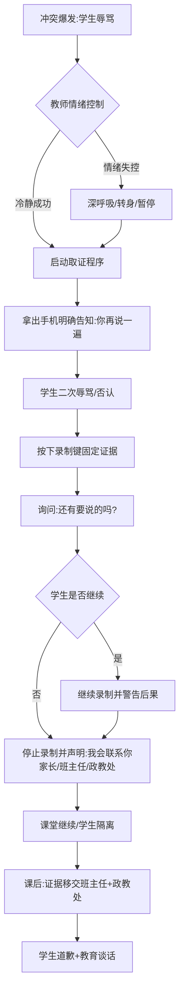

 ### 1、任务名称
**课堂突发冲突冷静取证与分级处置指南**

### 2、触发情景
- **学段与学校类型**：中等职业学校（中职），含"中本一体班"（直通本科）、"3+2班级"（对接大专）、普高转职高班及综合高中混合形态
- **学科场景**：信息技术/Python专业课（机房环境），但适用于所有学科的理论或实训课堂
- **学生特征**：16岁左右（高一），包含从普高转入的学业困难学生、学习动机薄弱、部分学生存在"针对教师"的对抗心理（如认为"上周不管这周管"是刻意针对）
- **冲突烈度**：学生当众辱骂教师（如"傻逼"等脏话）、持续违纪经警告无效、威胁性语言（"用我妈手机给你拉黑"）
- **时间约束**：120分钟连堂课（三节课连排）进行中，需在保证其他学生正常学习的前提下快速处置
- **物理环境**：机房或普通教室，教师需随身携带手机用于取证

### 3、核心问题
- **情绪失控风险**：新教师首次遭遇当众辱骂易"气疯"，陷入情绪对抗或当场哭泣，丧失教育权威性
- **证据缺失困境**：缺乏即时取证意识，导致事后班主任/政教处介入时陷入"各执一词"的罗生门，无法证明事件经过
- **处置边界模糊**：混淆"课堂即时管理"与"事后教育惩戒"，试图在课堂上当场"赢"过学生，导致冲突升级
- **技术依赖误区**：试图在冲突过程中当场使用AI搜索解决方案（"当场搜豆包"），会被学生视为可笑且削弱教师权威

### 4、解决方案
**核心流程（线性流+分支判断）**：

**关键策略细节**：
1. **冷静优先机制**：被气疯时强制启动"取证思维"转换——"我得留下证据"而非"我要吵架"
2. **话术模板**：
   - 取证引导："你再说一遍"（诱导重复违纪行为固化证据）
   - 程序宣告："我会联系你家长的""班主任、政教处会处理"
   - 态度确认："还有要说的吗？"（给予学生最后陈述机会，体现程序正义）
3. **分级处置**：
   - **一级（课堂内）**：不指名道姓提醒（"有些同学注意"）→ 三次机会警告 → 录像取证
   - **二级（课后）**：证据移交班主任 → 政教处介入 → 家长沟通（避免教师个人与家长直接对抗）
   - **三级（修复）**：接受道歉但明确底线（"你前一秒刚想夸你，你至少给我写了个import"），观察后续课堂表现

### 5、评价准则

**对过程的评价（权重40%）**：
| 维度 | 权重 | 分级描述 |
|------|------|----------|
| **情绪控制效能** | 15% | 优秀：全程无情绪失控，声音平稳，无哭泣或怒吼；合格：虽有情绪波动但能迅速切换至取证模式；不合格：与学生对骂、摔东西、当场哭泣离场 |
| **取证规范性** | 15% | 优秀：明确告知录制意图，画面清晰包含学生面部与言行，时长覆盖完整冲突过程；合格：有录像但画质/音质不清；不合格：未录像或偷拍侵犯隐私 |
| **育人保护性** | 10% | 优秀：取证时避免全班围观羞辱，课后谈话保护学生自尊（"不是针对你，是规则"）；合格：公开取证但事后安抚；不合格：当众羞辱或放任不管 |

**对结果的评价（权重60%）**：
| 维度 | 权重 | 分级描述 |
|------|------|----------|
| **证据有效性** | 20% | 优秀：视频清晰记录辱骂内容+教师冷静回应，可直接作为处分依据；合格：有证据但需补充说明；不合格：证据缺失或取证方式违规 |
| **纪律改善度** | 25% | 优秀：学生后续课堂专注度显著提升（"这个礼拜听的可认真了"），无报复行为；合格：学生收敛但偶有违纪；不合格：冲突升级或转为隐性对抗 |
| **程序合规性** | 15% | 优秀：完整经过班主任-政教处-家长三级程序，符合校规；合格：通知了班主任但未报政教处；不合格：教师私自处罚或网络曝光学生 |

### 5、评价准则（基于智能体输出的评价维度）

**对智能体取证建议的评价**：

| 维度 | 权重 | 优秀（A） | 合格（B） | 不合格（C） |
|------|------|-----------|-----------|-------------|
| **取证方法的科学性** | 30% | 提供的取证方法科学规范，符合教育法律要求，证据链完整 | 取证方法基本科学，但在某些环节可进一步规范 | 取证方法不当或缺乏科学依据 |
| **证据的合法性与有效性** | 25% | 收集的证据可直接用于处置冲突事件，法律效力高 | 证据基本有效，但在某些情况下可能存在漏洞 | 证据效力低，无法用于正式处置 |
| **对隐私的保护** | 25% | 充分考虑学生隐私保护，取证过程和存储方式均符合隐私法规 | 基本保护隐私，但在某些细节可更周密 | 取证方式侵犯隐私，存在法律风险 |
| **实际可操作性** | 20% | 一线教师在实际冲突发生时能迅速实施，无需特殊设备或大量准备 | 可操作，但需要一定的准备或技术支持 | 过于复杂或不切实际，难以在现场执行 |

### 6
、案例对比

**正面案例（专家教师实际做法）**：
> **情境**：高一Python课堂，女生与男友坐在一起持续讲话，经三次警告（全班警告→眼神提醒→走近提醒）后，学生大声辱骂"傻逼"。
> 
> **教师应对（叶老师原话）**：
> - **即时反应**："我第一反应就是我得留下证据，所以我就拿着手机，我跟他说，你再说一遍"
> - **话术引导**：学生否认"不是在骂你"后，坚持"那你再说一遍"，学生再次辱骂时按下录制键
> - **程序闭环**："我说还有要说的吗？他说没了，我就按下暂停了，然后就说我会联系你家长的...后面我就去找，就直接发给他们班主任了，后面是政教处协助去去让他向我道了个歉"
> - **教育智慧**：道歉时提及正向细节化解对立——"我前一秒刚想夸你...你至少给我写了个import"，既表明关注又强调规则
> 
> **后续效果**："这个礼拜倒是没有怎么敢讲话了，他这个礼拜听的可认真了"

**反面案例（典型误区）**：
- **情绪对抗型**：被辱骂后立即回骂或 sarcastic remark（"你爸妈怎么教你的"），导致冲突升级为肢体冲突风险
- **技术依赖型**："当场搜豆包学生要笑疯"——在冲突过程中低头看手机搜索"学生骂我怎么办"，丧失权威且被全班观看
- **和稀泥型**：因害怕冲突而假装没听见，或仅口头警告"下次注意"，导致课堂规则崩坏（"有些学生他不算那种...你说他再聪明，他也只是个学生"——暗示学生需要明确边界）
- **过度私有化**：未通过班主任/政教处，直接添加家长微信发送辱骂视频并指责，引发家长防御性对抗（"那我就用我妈手机给你拉黑"）

### 7、规范依据
- **《中小学教师职业道德规范》（2008年修订）**："关心爱护全体学生...不讽刺、挖苦、歧视学生，不体罚或变相体罚学生"——界定教师处置边界，禁止以暴制暴
- **《未成年人学校保护规定》（教育部令第50号，2021）**：明确学校应当建立学生欺凌防控和处置机制，教师遇突发情况应及时报告学校而非私自处置
- **《中等职业学校学生公约》**：强调"讲文明，重修养...遵法纪，守规章"，为课堂纪律管理提供校规依据
- **《中小学教育惩戒规则（试行）》**：第十二条明确教师不得"以击打、刺扎等方式直接造成身体痛苦的体罚"，但允许"一节课堂教学时间内的教室内站立"等即时措施，本指南中的"录像取证"属于固定证据而非惩戒，符合程序正义要求
### 8、测试情景（10个）

**情景1：突发冲突的实时记录**  
教师说："课堂上刚才发生了学生冲突，我需要马上记录下来，但怎样才能既保留关键事实，又避免主观评价导致记录无效？"

**情景2：证据的合法采集**  
教师问："学生冲突时我能不能用手机录音或拍照？这样做会不会违反学生隐私权？"

**情景3：目击证人的收集**  
教师说："冲突发生时有好几个同学看到了，我应该怎样规范地收集他们的证词，确保证词真实有效？"

**情景4：涉事学生的陈述记录**  
教师问："我应该在什么时候、以什么方式记录涉事学生的陈述？当场问还是事后问？问什么样的问题？"

**情景5：证据的保存与管理**  
教师说："我已经收集了照片、录音、证词等多种证据。我应该怎样保存这些证据，才能确保它们不被篡改或丢失？"

**情景6：隐私与透明的平衡**  
教师问："我需要证据来处置冲突，但同时要保护学生隐私。如果我把证据给家长看，会不会导致隐私泄露？"

**情景7：证据不足的补救**  
教师说："我记录的证据可能不够充分，导致处置冲突时说不清楚。还有什么弥补方法？"

**情景8：不同类型证据的权重**  
教师问："我收集了目击者证词、学生陈述和教师观察记录，但它们的法律效力是否相同？哪个权重更高？"

**情景9：后续跟进的证据链**  
教师说："冲突解决后，我还需要记录什么来证明处置过程的公正性？"

**情景10：综合证据评估与应用**  
教师说："我已经收集了所有证据，现在要用它们来说服家长接受我的处置决定。我应该怎样呈现这些证据才最有说服力？"